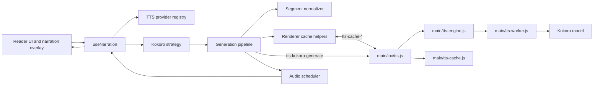
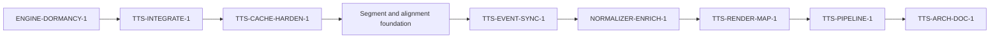
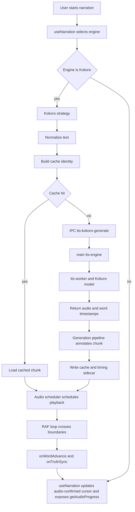

# Blurby TTS Architecture Completion Roadmap Audit

## Executive summary and verdict

**Executive verdict.** The roadmap is directionally strongest through `ENGINE-DORMANCY-1`, `TTS-INTEGRATE-1`, and `TTS-CACHE-HARDEN-1`. After that point, the plan becomes materially less dispatch-safe because the supplied `ROADMAP.md` is truncated inside `TTS-CACHE-HARDEN-1`, while the orientation document states that all eight full sprint specifications are present. For sprints `TTS-EVENT-SYNC-1` through `TTS-ARCH-DOC-1`, the audit therefore had to rely on `SPRINT_QUEUE.md`, the PM2 phase brief, and the research documents as secondary planning sources rather than the purported single source of truth. That is a repository-packaging and governance defect even if the canonical file outside the package may be complete. (`b1/ROADMAP.md`, lines 621–644; `AuditOrientation.1.2026-05-15.docx`, paras. 97–99, 213; `AuditRemediationPlan.1.2026-05-15.md`, lines 22–30.)

On code truth, Blurby already has a clear and largely respectable Kokoro-centered architecture: renderer orchestration in `useNarration`, a worker-isolated Kokoro engine, a pure segment normalizer, a rolling narration planner, a progressive generation pipeline, a Web Audio scheduler, and a structured v2 cache with timing sidecars. Those are not hypothetical; they are present now. But several roadmap and orientation statements overstate what is already delivered. In the actual code, MOSS-Nano and Pocket TTS are still selectable in the registry, still routed in `useNarration`, and still have active IPC handlers. The current mainline scheduler still advances words by comparing `AudioContext.currentTime` against precomputed boundaries in a RAF loop, and `useNarration` exposes `getAudioProgress()` specifically for polling consumers. The roadmap’s later event-driven and render-map work is therefore genuinely future work, not cleanup of architecture already landed. (`src/utils/ttsProviderRegistry.ts`, lines 94–151; `src/hooks/useNarration.ts`, lines 1064–1091, 1259–1288, 1504–1519, 1766–1782; `main/ipc/tts.js`, lines 177–255, 335–348; `src/utils/audioScheduler.ts`, lines 425–488, 765–816.)

The most important architectural weakness is not in the cache, the worker, or Kokoro scheduling. It is in modeling. The code has four different useful but non-equivalent identities: planner chunk ranges (`PlannedChunk`), normalization results (`SegmentNormalizationResult`), cache identities (`TtsCacheIdentityV2`), and scheduler chunks (`ScheduledChunk`). What it does **not** have is a first-class, durable narration segment model independent of cache invalidation and normalization version changes. The literature review treats stable segment identity as a priority recommendation, and the implementation review explicitly warns that the current normalizer contract is not alignment-map ready. The current conveyor only partially captures that issue. The result is a plan that is plausible for short-term Kokoro stabilization, but under-specified for the later promises around event-driven sync, render maps, and “export-ready” architecture. (`src/utils/narrationPlanner.ts`, lines 40–61, 178–242; `src/utils/segmentNormalizer.ts`, lines 28–38, 48–49, 339–387; `src/types/ttsCache.ts`, lines 10–24, 36–52; `src/hooks/narration/kokoroStrategy.ts`, lines 150–168; `b2/Blurby_TTS_Literature_Codebase_Review_2026-05-11.md`, lines 103–107, 578–580, 628–648; `b2/Blurby_Kokoro_TTS_Implementation_Review_2026-05-15.md`, lines 20–21, 165–178, 338.)

The correct high-level answer to the primary question is therefore: **mostly the right plan, partly the right order, but not yet for fully adequate reasons, and not with sufficient documentary discipline to be treated as unambiguous implementation guidance end-to-end**. The first half of the conveyor is grounded; the second half needs either a new segment/alignment foundation sprint or a hard go/no-go gate that delivers the same outcome before event-sync and render-map work proceeds. (`b1/ROADMAP.md`, lines 524–525, 555–617, 621–642; `b1/SPRINT_QUEUE.md`, lines 206–236, 240–260, 264–308, 338–340; `b2/Blurby_TTS_Literature_Codebase_Review_2026-05-11.md`, lines 105–107, 579, 644–648; `b2/Blurby_Kokoro_TTS_Implementation_Review_2026-05-15.md`, lines 333–346.)

### Scorecard

| Dimension | Score | Rationale |
|---|---:|---|
| Grounding in current codebase | 5/10 | Strong for sprints through `TTS-CACHE-HARDEN-1`; materially weaker for sprints 4–8 because the supplied `ROADMAP.md` is truncated and later sprint review relies on queue summaries and PM2 commentary instead of full specs. (`b1/ROADMAP.md`, lines 621–644; `b1/SPRINT_QUEUE.md`, lines 206–329.) |
| Architectural coherence | 6/10 | The roadmap generally follows the existing architecture seams of registry → strategy → pipeline → cache → scheduler, but it under-specifies durable segment identity and alignment foundations that the research docs treat as important. (`src/hooks/narration/kokoroStrategy.ts`, lines 174–261; `src/utils/generationPipeline.ts`, lines 255–338, 399–531; `src/utils/audioScheduler.ts`, lines 153–183; `b2/Blurby_TTS_Literature_Codebase_Review_2026-05-11.md`, lines 103–107, 578–580.) |
| Correct sequencing | 5/10 | `ENGINE-DORMANCY-1` → `TTS-INTEGRATE-1` → `TTS-CACHE-HARDEN-1` is correct. After that, event-sync and render-map are sequenced too aggressively without an explicit segment/alignment contract. (`b1/ROADMAP.md`, lines 525, 555–617, 621–642; `b1/SPRINT_QUEUE.md`, lines 206–236, 264–308; `b2/Blurby_Kokoro_TTS_Implementation_Review_2026-05-15.md`, lines 178–180, 338.) |
| Modeling soundness | 4/10 | Cache identity, planner chunks, and normalization metadata are individually coherent, but durable narration-segment identity is missing and `chunkId` is normalization-sensitive. (`src/utils/segmentNormalizer.ts`, lines 365–385; `src/hooks/narration/kokoroStrategy.ts`, lines 151–168; `main/tts-cache.js`, lines 106–123, 150–165; `b2/Blurby_TTS_Literature_Codebase_Review_2026-05-11.md`, lines 105–107, 579.) |
| Extensibility | 6/10 | The code is structurally extensible, especially the normalizer, planner, worker, and pipeline seams, but the one-way transform contract and informational-only registry constrain later sync/render-map evolution. (`src/utils/segmentNormalizer.ts`, lines 48–49, 248–387; `src/types/ttsProvider.ts`, lines 44–52; `b1/TECHNICAL_REFERENCE.md`, lines 418–422.) |
| Testability | 5/10 | Many core modules are pure and test-friendly, but critical cross-module parity tests are not visibly in the supplied code, and the roadmap back-loads too much validation into `TTS-PIPELINE-1`. (`src/utils/narrationPlanner.ts`, lines 178–242; `src/utils/segmentNormalizer.ts`, lines 339–387; `src/utils/generationPipeline.ts`, lines 399–531, 648–674; `b2/Blurby_Kokoro_TTS_Implementation_Review_2026-05-15.md`, lines 252–256, 333–346.) |
| Delivery practicality | 6/10 | The effort estimates for the first three sprints are plausible. `TTS-PIPELINE-1` is under-sized as currently described, and `TTS-RENDER-MAP-1` touches files outside the supplied TTS batches, reducing implementation confidence. (`b1/ROADMAP.md`, lines 572, 606, 642; `b1/SPRINT_QUEUE.md`, lines 264–285, 289–308.) |
| Overall confidence | 5/10 | Approve only with pre-dispatch corrections: restore full roadmap text to the audit bundle, fix documentation baseline drift, and make segment/alignment a real gate before event-sync and render-map work. (`AuditOrientation.1.2026-05-15.docx`, paras. 8–9, 203–205; `b1/ROADMAP.md`, lines 524–525, 621–644; `b1/SPRINT_QUEUE.md`, lines 206–236, 338–340.) |

## Current-state architecture summary

**Current-state architecture summary.** The supplied mainline code implements a renderer-led narration system that routes engine selection and user state through `useNarration`, uses `createKokoroStrategy` for Kokoro-specific synthesis behavior, delegates chunk sizing and ordering to `createGenerationPipeline`, schedules audio through `createAudioScheduler`, and persists reusable outputs through a main-process cache that supports both legacy v1 keys and structured v2 identities with timing sidecars. Kokoro generation itself is worker-thread isolated in `main/tts-engine.js` and `main/tts-worker.js`, with `wordTimestamps` returned from the worker and validated by the scheduler before they are trusted for word-following. (`src/hooks/useNarration.ts`, lines 1064–1091, 1744–1782; `src/hooks/narration/kokoroStrategy.ts`, lines 127–185, 263–360; `src/utils/generationPipeline.ts`, lines 255–338, 399–531; `src/utils/audioScheduler.ts`, lines 314–387, 425–488; `main/tts-cache.js`, lines 150–166, 193–222, 298–400; `main/tts-engine.js`, lines 263–339; `main/tts-worker.js`, lines 151–166.)

That architecture is technically meaningful, but the provider posture is still broader than the roadmap’s future-state framing. The registry marks Qwen disabled and unselectable, but MOSS-Nano and Pocket TTS remain selectable sidecar engines. `useNarration` still hard-branches across Kokoro, Qwen, Nano, Pocket, and Web Speech for chunk dispatch and pause/resume behavior, and the main IPC layer still exposes active Nano and Pocket synthesis/status/restart/shutdown handlers. This means the current product posture is “Kokoro default, other engines still wired,” not “Kokoro sole active engine.” (`src/utils/ttsProviderRegistry.ts`, lines 65–151, 162–164; `src/hooks/useNarration.ts`, lines 1064–1091, 1236–1289, 1504–1519; `main/ipc/tts.js`, lines 177–255, 257–287; `b1/TECHNICAL_REFERENCE.md`, lines 416–418, 424–426.)

The cache and timing model are more mature than the roadmap narrative suggests. `TtsCacheIdentityV2` already captures provider, voice, rate bucket, model version, source and normalized hashes, normalizer version, pronunciation override hash, document locator, chunk ID, sample rate, and timing truth. Main-process cache writes already produce `.timing.json` sidecars and persist `wordTimestamps` when classified as trusted. The scheduler then validates timing arrays strictly and falls back to heuristics if count, order, duration, or lexical correspondence do not hold. That is a solid fail-closed timing architecture already in place. (`src/types/ttsCache.ts`, lines 10–24, 36–52; `main/tts-cache.js`, lines 193–222, 341–357, 377–400; `src/utils/audioScheduler.ts`, lines 314–345, 358–387.)

What is notably **not** on main, by the roadmap’s own documentary record, is the centralized timing/highlight decision stack from `TTS-SYNC-1` and the redacted diagnostics bundle from `TTS-DIAG-1`. The completed-work summary says both are on pushed branches with merge pending, and the integration sprint exists to land them. That sequencing logic is correct: later sprints that assume `TimingMetadataStore`, `HighlightSyncController`, and branch-delivered diagnostics should not be judged as already implemented in canonical main. (`b1/ROADMAP.md`, lines 260–261, 587–605; `b1/SPRINT_QUEUE.md`, lines 150–172, 354–356.)

### What exists, what the roadmap assumes, what is missing

| Domain | What already exists | What the roadmap or orientation assumes | What is actually missing | What must happen before later items succeed |
|---|---|---|---|---|
| Engine posture | Registry, runtime branches, and IPC handlers for Kokoro, Web, Qwen, Nano, and Pocket are present; Nano and Pocket remain selectable and routed. (`src/utils/ttsProviderRegistry.ts`, lines 65–151; `src/hooks/useNarration.ts`, lines 1064–1091; `main/ipc/tts.js`, lines 177–255.) | Orientation describes Kokoro as the sole active engine and Nano/Pocket as already dormant. (`AuditOrientation.1.2026-05-15.docx`, paras. 8, 205.) | Actual dormancy gates for Nano and Pocket. | `ENGINE-DORMANCY-1` must change registry, settings UI, and IPC behavior before the codebase can honestly be described as Kokoro-only. (`b1/ROADMAP.md`, lines 555–580.) |
| Highlight sync | Scheduler emits `onWordAdvance`, `onTruthSync`, and exposes `getAudioProgress()` for polling. (`src/utils/audioScheduler.ts`, lines 128–183, 425–488.) | Orientation says event-driven highlight sync is already live. (`AuditOrientation.1.2026-05-15.docx`, para. 8.) | Event-driven highlight control on mainline and merge of `TTS-SYNC-1`. | `TTS-INTEGRATE-1` first, then `TTS-CACHE-HARDEN-1`, then event-sync work. (`b1/ROADMAP.md`, lines 587–605, 621–642.) |
| Registry abstraction | Registry records capabilities; `createStrategy` is an optional placeholder seam only. (`src/types/ttsProvider.ts`, lines 44–52; `b1/TECHNICAL_REFERENCE.md`, line 418.) | Some planning language implies a more active contract layer. | Runtime dispatch remains hardcoded in `useNarration`. | This is not a blocker for Kokoro-only completion, but documentation should state clearly that the current registry is informational. (`b1/ROADMAP.md`, lines 547–549; `src/hooks/useNarration.ts`, lines 1064–1091, 1504–1519.) |
| Cache parity | Fresh generations carry `boundaryType`, `silenceMs`, and `weightConfig`; cache reads rehydrate only audio, duration, words, and raw timestamps. (`src/utils/generationPipeline.ts`, lines 496–523; `src/utils/ttsCache.ts`, lines 26–55.) | `TTS-CACHE-HARDEN-1` correctly assumes parity is not yet achieved. | `timingTruth`, `chunkId`, `boundaryType`, and possibly other metadata are not rehydrated on cache hits. | `TTS-CACHE-HARDEN-1` is a true prerequisite for honest sync logic. (`b1/ROADMAP.md`, lines 623–636.) |
| Segment identity | Planner ranges, normalizer hashes, cache identities, and chunk IDs exist. (`src/utils/narrationPlanner.ts`, lines 40–61; `src/utils/segmentNormalizer.ts`, lines 28–38, 365–385; `src/types/ttsCache.ts`, lines 10–24.) | The later roadmap implies that alignment, render-map lookup, and export-adjacent goals can proceed without a first-class segment model. (`b1/SPRINT_QUEUE.md`, lines 206–236, 264–308.) | Durable `NarrationSegment` identity independent of normalization and cache invalidation. | This must be made explicit or at least hard-gated before event-sync and render-map work are allowed to define long-lived contracts. (`b2/Blurby_TTS_Literature_Codebase_Review_2026-05-11.md`, lines 103–107, 578–580; `b2/Blurby_Kokoro_TTS_Implementation_Review_2026-05-15.md`, lines 20–21, 338.) |
| Render map | No word-position index module is present in the supplied TTS batches. (`AuditOrientation.1.2026-05-15.docx`, paras. 146–201.) | `TTS-RENDER-MAP-1` assumes a future DOM index built in reader UI files. (`b1/SPRINT_QUEUE.md`, lines 264–285.) | The actual render-layer implementation and invalidation contract. | Stable sync semantics and segment/word identity must be defined first; render-layer files also need to be in scope for implementation. |

## Roadmap item-by-item audit

### Method note on roadmap completeness

The item-by-item audit is asymmetric by necessity. `ENGINE-DORMANCY-1`, `TTS-INTEGRATE-1`, and almost all of `TTS-CACHE-HARDEN-1` are present in full in the supplied `ROADMAP.md`. `TTS-EVENT-SYNC-1`, `NORMALIZER-ENRICH-1`, `TTS-RENDER-MAP-1`, `TTS-PIPELINE-1`, and `TTS-ARCH-DOC-1` are **not** present there, because the accessible roadmap copy ends inside the `TTS-CACHE-HARDEN-1` roster block. Those later sprints were therefore audited against `SPRINT_QUEUE.md`, the PM2 phase brief, and the two Batch 2 research documents, with assumptions stated explicitly. (`b1/ROADMAP.md`, lines 621–644; `b1/SPRINT_QUEUE.md`, lines 206–329; `b2/2026-05-15-pm2-phase-brief.md`, lines 5–18, 41–71.)

### Per-sprint audit at a glance

| Sprint | Audit verdict | Evidence grounding | Main defects | Recommended fix |
|---|---|---|---|---|
| `ENGINE-DORMANCY-1` | Correct first sprint | Strongly grounded in current code. (`src/utils/ttsProviderRegistry.ts`, lines 94–151; `src/hooks/useNarration.ts`, lines 1064–1091; `main/ipc/tts.js`, lines 177–255.) | Criterion language references a `posture` state pattern that does not actually exist as a structural enum. | Rewrite criteria in terms of `selectable`, `disabledReason`, and `statusKind`, and explicitly repair documentation baseline. |
| `TTS-INTEGRATE-1` | Correct second sprint | Correctly reflects branch/main split in roadmap records. (`b1/ROADMAP.md`, lines 260–261, 587–605.) | Audit package does not contain the branch files or closeout docs, so branch contents cannot be independently code-verified here. | Keep order, but mark evidence source as branch-closeout dependent. |
| `TTS-CACHE-HARDEN-1` | Best-specified sprint | Highly grounded in code asymmetries. (`src/utils/ttsCache.ts`, lines 26–55; `src/utils/generationPipeline.ts`, lines 496–523; `main/tts-cache.js`, lines 193–222, 377–400.) | Accessible roadmap text does not fully capture triple-storage reduction or document locator enrichment. | Keep sprint, add document locator enrichment and explicit triple-storage treatment. |
| `TTS-EVENT-SYNC-1` | Directionally right, structurally risky | Queue summary aligns with current scheduler polling model. (`src/utils/audioScheduler.ts`, lines 425–488, 765–816; `src/hooks/useNarration.ts`, lines 1759–1782; `b1/SPRINT_QUEUE.md`, lines 206–236.) | Alignment contract is under-specified; necessity of `normalizedToOriginalMap` is not fully justified against current `words`-aware Kokoro generate path. | Add a hard segment/alignment foundation gate or dedicated sprint before implementation. |
| `NORMALIZER-ENRICH-1` | Valid, but should be conditioned | Current normalizer is extensible and research support is real. (`src/utils/segmentNormalizer.ts`, lines 5–17, 248–387; `b2/Blurby_TTS_Literature_Codebase_Review_2026-05-11.md`, lines 88–90, 103–107, 298–306.) | Enriching transforms before alignment contracts are settled increases map complexity. | Limit to speech-only transforms unless alignment model is finalized first. |
| `TTS-RENDER-MAP-1` | Plausible but least grounded in supplied code | Research-derived, not current-code-derived. (`b1/SPRINT_QUEUE.md`, lines 264–285; `b2/Blurby_TTS_Literature_Codebase_Review_2026-05-11.md`, lines 176–180, 586.) | Depends on reader-layer files and stable segment identity not present in supplied TTS scope. | Re-sequence after explicit segment/alignment work. |
| `TTS-PIPELINE-1` | Necessary but under-sized | The intended trace test matches real cross-module seams. (`b1/SPRINT_QUEUE.md`, lines 289–308; `src/utils/generationPipeline.ts`, lines 399–531; `main/tts-cache.js`, lines 193–222, 377–400.) | Too much critical validation is deferred here. | Front-load cache parity and alignment proofs into earlier sprints; make this the heavier end-to-end and stress sprint. |
| `TTS-ARCH-DOC-1` | Useful capstone, insufficient as doc-repair mechanism | Governance need is real. (`b1/SPRINT_QUEUE.md`, lines 312–329.) | Current docs are already inaccurate; waiting until the end is too late for baseline truth. | Update governance continuously and use this sprint only for final ADR consolidation. |

**`ENGINE-DORMANCY-1`.** This is the right opening sprint. It is grounded in the actual code, because Nano and Pocket are still live at every layer that matters: registry, orchestration, and IPC. The spec’s central objective is therefore valid for the right reason: it removes real maintenance surface and real test interference rather than cleaning up already-dormant code. The main problem is specification precision. Criterion 1 says the registry entries should adopt a `posture: 'dormant'` or equivalent state matching Qwen’s `posture: 'disabled'` pattern, but the actual provider schema does not contain a machine-readable `posture` enum. It contains capability flags such as `selectable`, `disabledReason`, and `statusKind`, plus a human-readable `copy.posture` string. The sprint should be rewritten against actual fields, not an inferred pattern that does not exist. (`b1/ROADMAP.md`, lines 555–580; `src/types/ttsProvider.ts`, lines 16–52; `src/utils/ttsProviderRegistry.ts`, lines 65–151.)

The other incompleteness is ownership of profile migration. The spec points to `useNarration.ts` for profile migration, but the supplied TTS batches do not contain the settings persistence or `TTSSettings.tsx` implementation, so the exact migration locus cannot be verified from the package. That does not invalidate the sprint, but it means the acceptance criteria should name the persistence layer explicitly and not imply that `useNarration` alone is sufficient. (`b1/ROADMAP.md`, lines 567, 579–581; `AuditOrientation.1.2026-05-15.docx`, paras. 97–119, 146–201.)

**`TTS-INTEGRATE-1`.** This is also correctly placed. The roadmap accurately records that `TTS-SYNC-1` and `TTS-DIAG-1` are on pushed branches rather than canonical `main`, and later work should not pretend otherwise. Given that the supplied mainline TTS files do not include `TimingMetadataStore` or `HighlightSyncController`, the existence of this integration sprint is not bureaucratic overhead. It is an actual prerequisite. (`b1/ROADMAP.md`, lines 260–261, 587–617; `b1/SPRINT_QUEUE.md`, lines 150–172, 354–356.)

Its weakness is evidentiary rather than conceptual. The closeout artifacts and merged branch contents are not in the supplied package, so this audit cannot independently validate the claimed branch completeness, conflict profile, or test-pass status. The sprint therefore makes sense, but its trust base is documentary rather than code-inspected within the current package. That uncertainty should be stated in the roadmap or queue instead of hidden behind “PASS/pushed” shorthand. (`b1/ROADMAP.md`, lines 589–605; `b1/SPRINT_QUEUE.md`, lines 354–356.)

**`TTS-CACHE-HARDEN-1`.** This is the most cogent and best-grounded sprint in the conveyor. The problem it targets is plainly visible in code. Fresh generations emit `ScheduledChunk` objects with `weightConfig`, `boundaryType`, `silenceMs`, and `wordTimestamps`; cache reads reconstruct only `audio`, `sampleRate`, `durationMs`, `words`, `startIdx`, and raw `wordTimestamps`. At the same time, the main cache’s notion of “trusted” timing is weaker than the scheduler’s, because the sidecar classification does not require timestamp count to match chunk size, while the scheduler’s validator does. The roadmap correctly identifies this as a prerequisite for later sync correctness. (`src/utils/generationPipeline.ts`, lines 496–523; `src/utils/ttsCache.ts`, lines 26–55; `main/tts-cache.js`, lines 193–222, 377–400; `src/utils/audioScheduler.ts`, lines 319–345; `b1/ROADMAP.md`, lines 623–636.)

Two improvements are still needed. First, the code already anticipates richer location identity through `documentLocator.sectionId` and `documentLocator.cfi`, but `getCacheIdentity()` currently supplies only `{ bookId }`. That weakens later traceability and export readiness. Second, the PM2 brief maps “triple-storage reduction” into this sprint, but the accessible roadmap language focuses on classification harmonization rather than authoritative timing ownership; the code still stores timing truth in several places. That should be made explicit in the spec rather than implied. (`src/types/ttsCache.ts`, lines 4–8; `src/hooks/narration/kokoroStrategy.ts`, lines 151–165; `main/tts-cache.js`, lines 196–218, 333–355; `b2/2026-05-15-pm2-phase-brief.md`, lines 54–63.)

**`TTS-EVENT-SYNC-1`.** The direction is right. The current mainline does use a RAF-driven scheduler loop to detect crossed boundaries and advance the audio-confirmed cursor, and `useNarration` explicitly surfaces `getAudioProgress()` for render-layer polling. Replacing or demoting that polling in favor of more direct boundary callbacks is therefore a real architectural move, not a synthetic one. The queue summary also correctly preserves a fallback concept rather than assuming that every engine will become word-native. (`src/utils/audioScheduler.ts`, lines 425–488, 765–816; `src/hooks/useNarration.ts`, lines 1740–1782; `b1/SPRINT_QUEUE.md`, lines 206–236; `b1/LESSONS_LEARNED.md`, lines 855–909.)

The sprint is risky because its modeling basis is not solid enough yet. The queue summary says the sprint will add a `normalizedToOriginalMap` during normalization while explicitly **not** changing the current `TransformFn = (text: string) => string` contract. The implementation review warns that this assumption is false if taken literally, because destructive regex transforms make reliable span tracking difficult without a richer transform-result contract. That is a substantive, not editorial, concern. There is another under-explained point: the current Kokoro path already sends original `words` alongside normalized text into `ttsInstance.generate`, and the scheduler then validates timestamps against those original words. The roadmap summary does not explain why that existing mechanism is insufficient for the event it wants to promote. Until that is explicit, the sprint is not fully cogent. (`src/utils/segmentNormalizer.ts`, lines 48–49, 248–387; `src/hooks/narration/kokoroStrategy.ts`, lines 174–185; `main/tts-worker.js`, lines 151–166; `src/utils/audioScheduler.ts`, lines 319–345; `b1/SPRINT_QUEUE.md`, lines 210–216, 220–236; `b2/Blurby_Kokoro_TTS_Implementation_Review_2026-05-15.md`, lines 20–21, 165–178, 338.)

**`NORMALIZER-ENRICH-1`.** This sprint is well motivated by the literature review. The current normalizer is clean, versioned, and ordered; adding new transform IDs and pure transform functions is operationally straightforward. The research support from Abogen for more comprehensive English normalization is real, and the roadmap’s desire to fill obvious gaps such as richer abbreviations, ranges, and context-sensitive pronunciations is sound. (`src/utils/segmentNormalizer.ts`, lines 5–17, 158–169, 248–387; `b1/SPRINT_QUEUE.md`, lines 240–260; `b2/Blurby_TTS_Literature_Codebase_Review_2026-05-11.md`, lines 88–90, 297–306.)

The sequencing risk is that expanding transforms before finalizing alignment semantics increases the surface area of the alignment problem. The implementation review states that normalizer enrichment is perfectly clean for **speech-only** improvement, but not necessarily for imminent render-map-dependent alignment work. That means the sprint is coherent only if its acceptance criteria explicitly state either that alignment remains unchanged and speech quality is the only goal, or that an alignment-aware transform contract is in place first. (`b2/Blurby_Kokoro_TTS_Implementation_Review_2026-05-15.md`, lines 131, 165–178, 338; `b1/SPRINT_QUEUE.md`, lines 244–257.)

**`TTS-RENDER-MAP-1`.** As a performance and UX idea, this sprint is sensible. The queue summary’s stated goal—resolve word-following positions through an index rather than repeated live DOM queries—is consistent with the lessons-learned record that wants the visual follower to depend on a single canonical progress source and avoid excessive per-frame geometry work. The Sioyek inspiration is also research-faithful. (`b1/SPRINT_QUEUE.md`, lines 264–285; `b1/LESSONS_LEARNED.md`, lines 855–889; `b2/Blurby_TTS_Literature_Codebase_Review_2026-05-11.md`, lines 176–180, 586.)

Its grounding in the supplied package is still weak. The implementation sites named in the queue include `FoliatePageView.tsx` and a new `wordPositionIndex.ts`, but those files are not in the supplied TTS batches, so the actual reader-side DOM model and invalidation triggers cannot be audited here. More importantly, a render map is only as stable as the segment and word identities it keys against. Because that foundation remains implicit, `TTS-RENDER-MAP-1` should not be treated as a simple optimization sprint. It is dependent on upstream identity decisions. (`AuditOrientation.1.2026-05-15.docx`, paras. 146–201; `b1/SPRINT_QUEUE.md`, lines 268–279; `b2/Blurby_TTS_Literature_Codebase_Review_2026-05-11.md`, lines 579, 701–707.)

**`TTS-PIPELINE-1`.** The architectural instinct here is correct. The code absolutely would benefit from a single end-to-end proof that one chunk can be traced through planner → normalization → cache identity → timing sidecar → playback timing → UI-facing sync decision. The current modules are already sufficiently separated to make that kind of contract test meaningful. (`src/utils/narrationPlanner.ts`, lines 178–242; `src/utils/segmentNormalizer.ts`, lines 339–387; `src/types/ttsCache.ts`, lines 10–24, 36–52; `src/utils/generationPipeline.ts`, lines 399–531; `main/tts-cache.js`, lines 193–222, 377–400; `b1/SPRINT_QUEUE.md`, lines 289–308.)

What is not convincing is the sprint size and timing. The queue summary packs together end-to-end tracing, cache parity verification, mixed-length and rapid pause/resume stress fixtures, and normalization fixture expansion into an `S` effort. The implementation review independently identifies cache-hit parity, resume backpressure, and a full pipeline trace as important blind spots. Those are too load-bearing to be treated as a late, lightweight cleanup sprint. Critical parity and adversarial-alignment tests belong earlier as hard gates, with this sprint re-scoped upward as the broader stress and integration truth sprint. (`b1/SPRINT_QUEUE.md`, lines 289–308; `src/utils/generationPipeline.ts`, lines 648–674; `b2/Blurby_Kokoro_TTS_Implementation_Review_2026-05-15.md`, lines 252–256, 339–346.)

**`TTS-ARCH-DOC-1`.** A final architecture-decisions document is appropriate. The queue’s proposed contents—engine posture decisions, subsystem layers, research provenance, error taxonomy, and cache evolution—are all worthwhile and align with the fact that Blurby’s TTS stack is no longer small enough to govern by memory. (`b1/SPRINT_QUEUE.md`, lines 312–329.)

The flaw is not the sprint itself; it is the implied governance cadence. Current documentation already contains inaccurate present-tense claims, especially in the orientation document. A last-sprint governance artifact cannot be the only point at which baseline truth is restored. Documentation corrections must happen inside each sprint closeout, with `TTS-ARCH-DOC-1` reserved for durable synthesis rather than deferred cleanup. (`AuditOrientation.1.2026-05-15.docx`, paras. 8–9, 203–205; `b1/ROADMAP.md`, lines 524–525; `b1/TECHNICAL_REFERENCE.md`, lines 416–418.)

### Major contradictions

| Contradiction | Documentary claim | Code or repo reality | Why it matters |
|---|---|---|---|
| Engine posture | Orientation says Kokoro is the sole active engine and Nano/Pocket are already dormant. (`AuditOrientation.1.2026-05-15.docx`, paras. 8, 205.) | Nano and Pocket are still selectable, routed, and IPC-live. (`src/utils/ttsProviderRegistry.ts`, lines 94–151; `src/hooks/useNarration.ts`, lines 1064–1091, 1259–1288; `main/ipc/tts.js`, lines 177–255.) | It misframes `ENGINE-DORMANCY-1` as cleanup instead of a real product-posture change. |
| Sync status | Orientation says event-driven highlight synchronization is part of the current subsystem. (`AuditOrientation.1.2026-05-15.docx`, para. 8.) | The scheduler still advances word state in a RAF loop, and `getAudioProgress()` is exposed for polling. Branch-delivered centralized sync artifacts are still merge-pending. (`src/utils/audioScheduler.ts`, lines 425–488, 765–816; `src/hooks/useNarration.ts`, lines 1759–1782; `b1/ROADMAP.md`, lines 260–261, 587–605.) | Later sprints are being described as if the baseline were already more advanced than it is. |
| Registry posture model | `ENGINE-DORMANCY-1` criterion 1 refers to a machine-level `posture` state like Qwen. (`b1/ROADMAP.md`, lines 563–566.) | The actual schema uses `selectable`, `disabledReason`, `statusKind`, and a human-readable copy field named `posture`; there is no enum posture slot. (`src/types/ttsProvider.ts`, lines 16–52; `src/utils/ttsProviderRegistry.ts`, lines 65–151.) | The sprint spec is not implementation-exact. |
| Export-readiness claim | The roadmap finish line says this phase makes the TTS system export-ready. (`b1/ROADMAP.md`, lines 524–525.) | The queue says `KOKORO-EXPORT-1` is deferred and export depends on durable segment identity, cache, timing, and highlight truth; no explicit durable-segment sprint exists in the conveyor. (`b1/SPRINT_QUEUE.md`, lines 338–340.) | The roadmap overstates downstream readiness and understates a missing prerequisite. |
| PM2 mapping vs accessible roadmap | PM2 says “triple-storage reduction” is a cache-hardening finding mapped into the sprint. (`b2/2026-05-15-pm2-phase-brief.md`, lines 54–63.) | The accessible roadmap spec focuses on timing-classification harmonization but does not clearly state authoritative timing ownership reduction. (`b1/ROADMAP.md`, lines 629–639.) | The planning artifacts are not perfectly aligned on what the sprint is meant to deliver. |
| Remediation note vs supplied `CLAUDE.md` | The remediation plan says orientation **and** `CLAUDE.md` use future-state language about Kokoro-only posture. (`AuditRemediationPlan.1.2026-05-15.md`, lines 38–53.) | The supplied `CLAUDE.md` actually says runtime playback behavior is unchanged after the registry sprint and points to `ENGINE-DORMANCY-1` as the next posture shift. (`b1/CLAUDE.md`, lines 342–349.) | Even the remediation artifact should not be taken as presumptively accurate; code and primary docs still outrank it. |

## Sequencing analysis and structural review

### Sequencing analysis

The current sequence is most defensible through sprint 3. `ENGINE-DORMANCY-1` first is right because it converts a documentation fiction into runtime truth and removes sidecar-engine interference. `TTS-INTEGRATE-1` second is right because down-conveyor work should not build against branch-only sync/diagnostics. `TTS-CACHE-HARDEN-1` third is right because event-driven or policy-driven sync decisions should not depend on cache hits that lack the same metadata as fresh generations. (`b1/ROADMAP.md`, lines 525, 555–617, 621–642; `b1/SPRINT_QUEUE.md`, lines 176–203.)

The risk begins at `TTS-EVENT-SYNC-1`. The research record makes stable segment metadata and durable IDs a core recommendation, not a cosmetic enhancement. The implementation review separately warns that the current normalizer contract is not automatically alignment-map ready. Yet the conveyor moves directly from cache hardening into event-driven sync, then into further normalizer enrichment, then into a render map. That is not the cleanest dependency order. The later work is trying to build user-facing timing and geometry systems on top of identities that are still partly cache-derived and normalization-sensitive. (`b2/Blurby_TTS_Literature_Codebase_Review_2026-05-11.md`, lines 103–107, 578–580, 628–648; `b2/Blurby_Kokoro_TTS_Implementation_Review_2026-05-15.md`, lines 20–21, 165–178, 338.)

The clean sequencing rule is simple. Before event-driven sync can become the primary highlight trigger, four things must already be true: the sync stack must actually be on `main`; cache-hit timing parity must be fixed; the segment/alignment contract must be explicit; and the fallback relationship with RAF-based interpolation must be preserved according to the lessons-learned guardrails. Before render maps can be trusted, the event contract and segment identity must be stable. Before export can be called viable, `documentLocator` must carry more than `bookId`, and durable segment identity must not be tied to cache invalidation semantics. (`b1/ROADMAP.md`, lines 587–605, 621–642; `b1/SPRINT_QUEUE.md`, lines 210–236, 264–308, 338–340; `src/hooks/narration/kokoroStrategy.ts`, lines 151–165; `src/types/ttsCache.ts`, lines 4–8; `b1/LESSONS_LEARNED.md`, lines 855–909.)

### Structural and modeling review

The current codebase has **coherent separation of concerns**, but not complete semantic identity modeling. `PlannedChunk` is a boundary-planning type. `SegmentNormalizationResult` is a text-transformation type. `TtsCacheIdentityV2` is a cache-invalidation and reuse type. `ScheduledChunk` is a playback transport type. That separation is good engineering. The problem is that later roadmap items want a fifth concern—stable narration segment identity for alignment, highlight anchoring, and eventually export—without making it first-class. (`src/utils/narrationPlanner.ts`, lines 40–61; `src/utils/segmentNormalizer.ts`, lines 28–38; `src/types/ttsCache.ts`, lines 10–24; `src/utils/audioScheduler.ts`, lines 79–103; `b2/Blurby_TTS_Literature_Codebase_Review_2026-05-11.md`, lines 103–107, 578–580.)

The best indicator that cache identity is not durable segment identity is the combination of `kokoroStrategy.getCacheIdentity()` and `main/tts-cache.js.structuredContentKey()`. `chunkId` is built as ``${bookId}:${startIdx}:${normalization.normalizationHash}``, and `normalizationHash` itself incorporates `TTS_NORMALIZER_VERSION`, source and normalized hashes, override hash, locale, and transform IDs. That means the chunk identifier changes when normalization rules change, which is appropriate for cache invalidation but poor for durable logical identity. Meanwhile, the content-address key used for reuse intentionally omits `documentLocator` and `chunkId`, because cache reuse is content-based rather than location-based. That is good cache design and simultaneously proof that cache identity and logical segment identity are not the same thing. (`src/hooks/narration/kokoroStrategy.ts`, lines 151–168; `src/utils/segmentNormalizer.ts`, lines 365–385; `main/tts-cache.js`, lines 106–123, 150–165.)

`documentLocator` is also under-modeled relative to the stated finish line. The type already provides `sectionId` and `cfi`, but the current Kokoro strategy only populates `bookId`. That is acceptable for a pure disk cache, but not for any roadmap language that points toward stable export, subtitles, or precise cross-section anchoring. The type already tells the story: the implementation has stopped halfway. (`src/types/ttsCache.ts`, lines 4–8; `src/hooks/narration/kokoroStrategy.ts`, lines 151–165.)

The timing model is stronger than the later roadmap prose sometimes implies. The scheduler validates real timestamps with exact word-count matching, monotonicity, lexical equality, and duration sanity checks, then degrades to heuristics when trust is broken. This is an honest and technically sound model. The inconsistency is that `main/tts-cache.js` classifies sidecar timing as trusted under a weaker criterion and then only conditionally returns timestamps from cache. That mismatch is exactly why `TTS-CACHE-HARDEN-1` is good. The canonical timing truth should be modeled once and derived consistently. (`src/utils/audioScheduler.ts`, lines 314–345, 358–387; `main/tts-cache.js`, lines 196–220, 397–400; `b1/ROADMAP.md`, lines 629–635.)

The lifecycle diagram also shows the current modeling gap in concrete terms: on cache hits, `loadCachedChunk()` reconstructs only a subset of what fresh generation carries, and the scheduler still uses a RAF loop to cross precomputed boundaries rather than a direct provider event stream. Those are precisely the right targets for hardening and later sync work. (`src/utils/ttsCache.ts`, lines 26–55; `src/utils/generationPipeline.ts`, lines 496–523; `src/utils/audioScheduler.ts`, lines 425–488; `main/ipc/tts.js`, lines 335–348; `main/tts-engine.js`, lines 321–327; `main/tts-worker.js`, lines 151–166.)

## Testing review, top risks, and missing work

### Testing review

The supplied package does not include the actual test files, so the documented counts and pass rates cannot be independently verified from code in this audit. Where the orientation document says the repository has 2,397 tests across 150 files, that should be treated here as a documentary claim rather than observed fact. What **can** be verified is that the code contains many modules with strong unit-test surfaces: `segmentNormalizer.ts`, `narrationPlanner.ts`, the validator and boundary logic in `audioScheduler.ts`, and most of `generationPipeline.ts` are all predominantly pure or side-effect-bounded. (`AuditOrientation.1.2026-05-15.docx`, paras. 7, 15–28; `src/utils/segmentNormalizer.ts`, lines 248–387; `src/utils/narrationPlanner.ts`, lines 178–333; `src/utils/audioScheduler.ts`, lines 56–75, 314–420; `src/utils/generationPipeline.ts`, lines 128–203, 305–338, 399–531.)

The roadmap under-allocates contract testing. The cross-module seams that matter most for correctness are not the obvious unit seams; they are the transitions from normalizer to cache identity, from cache sidecar to renderer chunk rehydration, from scheduler boundary truth to UI callback semantics, and from pause/resume buffer behavior to backpressure. The implementation review identifies precisely these blind spots: cache replay parity, end-to-end trace testing, alignment fixtures, and resume-flush backpressure. Those should not remain mostly deferred to `TTS-PIPELINE-1`. (`b2/Blurby_Kokoro_TTS_Implementation_Review_2026-05-15.md`, lines 252–256, 333–346; `b1/SPRINT_QUEUE.md`, lines 180–182, 216, 293.)

A minimal acceptance-oriented test matrix should therefore look like this:

| Test layer | Code focus | What it proves | When it must exist |
|---|---|---|---|
| Unit | `segmentNormalizer.ts` | Transform ordering, version hashing, fixture exactness, future alignment invariants. | Before `NORMALIZER-ENRICH-1` closes. |
| Unit | `main/tts-cache.js` and `src/utils/ttsCache.ts` | Sidecar classification, cache-hit rehydration, v1 slash safety, identity shape rejection. | During `TTS-CACHE-HARDEN-1`. |
| Unit | `generationPipeline.ts` | Resume backpressure, duplicate-start guard, chunk emission ordering, pause-buffer correctness. | During `TTS-CACHE-HARDEN-1` and `TTS-PIPELINE-1`. |
| Integration | Kokoro path end-to-end | Normalizer → identity → IPC → worker → sidecar → scheduler coherence on miss and hit. | Earlier than current `TTS-PIPELINE-1` scope implies. |
| Adversarial fixtures | Alignment work | Repeated words, punctuation deletion, abbreviations, dates, currency, ordinals, contractions. | Hard gate before `TTS-EVENT-SYNC-1` implementation. |
| UX/performance | Scheduler and render layer | RAF fallback safety, callback latency, render-map invalidation, bounded drift. | During `TTS-EVENT-SYNC-1` and `TTS-RENDER-MAP-1`. |

The crucial testing judgment is that `TTS-PIPELINE-1` should not be the first time the project proves cache-hit parity or alignment survivability. Those are prerequisite truths, not end-of-conveyor verification luxuries. (`b1/SPRINT_QUEUE.md`, lines 180–182, 216, 289–308; `b2/Blurby_Kokoro_TTS_Implementation_Review_2026-05-15.md`, lines 123–130, 143–150.)

### Top risks

| Risk | Evidence | Impact | Mitigation |
|---|---|---|---|
| Segment and alignment modeling remains implicit | Research calls for stable `NarrationSegment`; code lacks it; roadmap only gestures indirectly toward it. (`b2/Blurby_TTS_Literature_Codebase_Review_2026-05-11.md`, lines 103–107, 578–580; `src/utils/segmentNormalizer.ts`, lines 48–49; `src/hooks/narration/kokoroStrategy.ts`, lines 151–168.) | Later event-sync, render-map, and export work rest on brittle identity assumptions. | Add a dedicated foundation sprint or hard Phase 0 deliverable before event-sync. |
| Cache-hit and cache-miss semantics diverge | Fresh chunks and cached chunks do not carry identical metadata; cache timing trust is weaker than scheduler trust. (`src/utils/generationPipeline.ts`, lines 496–523; `src/utils/ttsCache.ts`, lines 26–55; `main/tts-cache.js`, lines 196–220, 377–400; `src/utils/audioScheduler.ts`, lines 319–345.) | Highlight, diagnostics, and timing policy can differ between first playback and replay. | Keep `TTS-CACHE-HARDEN-1` early and make parity tests mandatory, not advisory. |
| Documentary baseline drift | Orientation misstates current engine posture and sync state; supplied roadmap is truncated. (`AuditOrientation.1.2026-05-15.docx`, paras. 8–9, 97–99, 203–205; `b1/ROADMAP.md`, lines 621–644.) | Implementation teams start from false assumptions and later audit judgments become noisy. | Repair docs continuously and ensure future audit bundles include a complete roadmap artifact. |
| Event-sync wording could break proven visual guardrails | LL-077 and LL-079 require a single canonical progress source and separation of visual and audio authority. (`b1/LESSONS_LEARNED.md`, lines 855–909.) | An over-broad “replace RAF” interpretation could reintroduce cursor contamination or jitter. | Define event-sync as demotion from hot path, not wholesale removal of interpolation/fallback mechanisms. |
| Resume flush can overwhelm scheduler | `pipelineResume()` flushes all buffered chunks synchronously without queue-depth checks. (`src/utils/generationPipeline.ts`, lines 653–663.) | Memory spikes or scheduling starvation after long pauses. | Treat resume backpressure as a non-optional fix if the file is touched. |
| `documentLocator` stays too shallow | Type anticipates `sectionId` and `cfi`; implementation only sets `bookId`. (`src/types/ttsCache.ts`, lines 4–8; `src/hooks/narration/kokoroStrategy.ts`, lines 151–165.) | Any future export, subtitle, or cross-section anchoring will have to retrofit identity after the fact. | Enrich now during cache-hardening while identity code is already open. |

### Missing work

| Missing work item | File-level pointers | Why it is missing | Suggested action |
|---|---|---|---|
| First-class durable narration segment model | `src/utils/narrationPlanner.ts`, `src/utils/segmentNormalizer.ts`, `src/hooks/narration/kokoroStrategy.ts`, `src/types/ttsCache.ts` | Current code has planner ranges, normalization hashes, and cache identity, but no durable logical segment. | Introduce `NarrationSegment` with stable ID, offsets, original/normalized text, and structural kind before render-map or export-adjacent claims. |
| Explicit alignment contract | `src/utils/segmentNormalizer.ts`, `src/hooks/narration/kokoroStrategy.ts` | The roadmap summary wants `normalizedToOriginalMap`, but the transform contract is still one-way. | Either upgrade transforms to report span mutations or formally constrain a diff-based map with adversarial fixtures and escalation criteria. |
| Cache-hit metadata rehydration | `src/utils/ttsCache.ts`, `src/utils/audioScheduler.ts`, `src/types/ttsCache.ts`, `main/tts-cache.js` | Cache reads do not reconstruct the metadata that later sync logic needs. | Add canonical timing classification, rehydrate `timingTruth`, `chunkId`, `boundaryType`, and validate shapes on read. |
| `documentLocator` enrichment | `src/hooks/narration/kokoroStrategy.ts`, `src/types/ttsCache.ts` | The type anticipates richer location identity than the implementation supplies. | Populate at least `sectionId`; support `cfi` when available. |
| Runtime identity validation | `main/tts-cache.js`, `main/ipc/tts.js` | Main-process JS accepts structured identities and cache reads with minimal shape checks. | Add lightweight runtime guards at the IPC and cache boundaries. |
| Earlier hard-gate tests | New tests covering parity and alignment; touches `generationPipeline.ts`, `tts-cache.js`, normalizer fixtures | Roadmap pushes too much into `TTS-PIPELINE-1`. | Require cache parity tests in `TTS-CACHE-HARDEN-1` and alignment proof in `TTS-EVENT-SYNC-1` Phase 0. |
| Continuous governance repair | `ROADMAP.md`, `SPRINT_QUEUE.md`, `TECHNICAL_REFERENCE.md`, orientation materials | Current docs contradict current code. | Update baseline posture and sync claims as each sprint lands rather than waiting for `TTS-ARCH-DOC-1`. |

## Proposed revised roadmap and final recommendation

### Proposed revised roadmap

A revised plan should preserve the strong front half of the conveyor and make the missing identity/alignment foundation explicit. The preferred revision adds one small-to-medium sprint. If the conveyor **must** remain at eight named sprints, the same work should be folded into `TTS-EVENT-SYNC-1` as a hard gate and its effort should be increased from medium to large. The preferred nine-step version is the safer technical program.

| Sequence | Sprint | Effort | Purpose | Minimal acceptance criteria |
|---|---|---|---|---|
| 1 | `ENGINE-DORMANCY-1` | Small | Make actual product posture match narrative posture. | Nano and Pocket are unselectable, return dormant IPC errors, and existing settings migrate cleanly to Kokoro; docs are updated to present-tense truth. |
| 2 | `TTS-INTEGRATE-1` | Small–Medium | Land `TTS-SYNC-1` and `TTS-DIAG-1` onto canonical `main`. | Branch-delivered sync and diagnostics artifacts are merged, verified, and reflected in governance records. |
| 3 | `TTS-CACHE-HARDEN-1` | Medium | Make cache-hit semantics equivalent to fresh generation and harden IPC/cache typing. | Canonical timing classification exists; cache-hit chunks rehydrate required metadata; v1 slash safety and runtime shape checks are in place; parity tests pass. |
| 4 | `TTS-SEGMENT-ALIGN-1` | Medium | Define durable segment identity and alignment contract. | `NarrationSegment` exists; `documentLocator` is enriched; either alignment-aware transforms exist or a fixture-proven diff map contract with escalation criteria is approved. |
| 5 | `TTS-EVENT-SYNC-1` | Medium | Promote boundary callbacks to primary highlight trigger while retaining RAF-based interpolation/fallback where needed. | Event path is primary for word-native timing; LL-077 and LL-079 guardrails remain intact; latency and drift baselines are measured and acceptable. |
| 6 | `NORMALIZER-ENRICH-1` | Medium | Expand Kokoro normalization safely on top of the chosen alignment model. | New transforms are fixture-backed, ordering-stable, version-bumped, and alignment-safe by the contract chosen in step 4. |
| 7 | `TTS-RENDER-MAP-1` | Medium–Large | Build reader-side position index on top of stable identity and event semantics. | DOM index builds and invalidates correctly, degrades gracefully, and improves p95 lookup cost without contaminating narration state. |
| 8 | `TTS-PIPELINE-1` | Medium | Prove end-to-end truth under stress. | Full-chain integration trace passes for miss and hit paths; pause/resume, mixed-length, and all-cache-hit stress fixtures pass; long-form drift budget is documented. |
| 9 | `TTS-ARCH-DOC-1` | Small | Consolidate final architecture decisions and provenance. | ADR-style document covers engine posture, subsystem layers, timing/error taxonomy, research provenance, cache evolution, and deferred lanes. |

This ordering is not a dramatic re-architecture. It mostly reclassifies one currently implicit dependency as explicit. That change is justified by both code and research. The literature review identifies deterministic segment IDs as a high-priority gap, and the implementation review warns that the transform contract is not readiness-proof for later alignment-driven features. The revised sequence simply stops pretending those issues are optional until after event-sync and render-map work. (`b2/Blurby_TTS_Literature_Codebase_Review_2026-05-11.md`, lines 103–107, 578–580, 632–648; `b2/Blurby_Kokoro_TTS_Implementation_Review_2026-05-15.md`, lines 20–21, 165–178, 333–346.)

### Final recommendation with scores

The roadmap should **not** be approved as-is for unqualified dispatch. It should be approved **conditionally** with the following pre-dispatch corrections: restore a complete `ROADMAP.md` artifact to the audit package; correct present-tense documentation drift about engine posture and sync state; rewrite `ENGINE-DORMANCY-1` against actual registry fields; and make segment/alignment modeling a real deliverable before `TTS-EVENT-SYNC-1` implementation begins. With those corrections, the plan becomes credible and technically coherent. Without them, the conveyor remains directionally promising but too under-specified in its back half to justify high confidence. (`b1/ROADMAP.md`, lines 524–525, 555–617, 621–644; `AuditOrientation.1.2026-05-15.docx`, paras. 8–9, 203–205; `b1/SPRINT_QUEUE.md`, lines 206–236, 338–340.)

| Dimension | Score | Concise rationale |
|---|---:|---|
| Grounding in current codebase | 5/10 | Strong through cache hardening; weaker later because full roadmap specs are missing from the supplied artifact set. |
| Architectural coherence | 6/10 | Existing seams are respected, but the roadmap under-specifies segment/alignment foundations. |
| Correct sequencing | 5/10 | First three sprints are well ordered; later dependencies are too implicit. |
| Modeling soundness | 4/10 | Cache identity and planner modeling are good; durable segment identity is still missing. |
| Extensibility | 6/10 | Worker, pipeline, planner, and normalizer are extensible, but later UI/timing work needs a stronger contract base. |
| Testability | 5/10 | Core modules are test-friendly; critical parity and alignment tests should move earlier. |
| Delivery practicality | 6/10 | Most effort bands are plausible, but `TTS-PIPELINE-1` is under-sized and `TTS-RENDER-MAP-1` reaches beyond the supplied TTS scope. |
| Overall confidence | 5/10 | Conditional approval only; the roadmap is not yet fully dispatch-safe as provided. |

### Feedback disposition template

| Feedback item | Disposition | Short rationale |
|---|---|---|
| F1 |  |  |
| F2 |  |  |
| F3 |  |  |
| F4 |  |  |
| F5 |  |  |
| F6 |  |  |
| F7 |  |  |
| F8 |  |  |